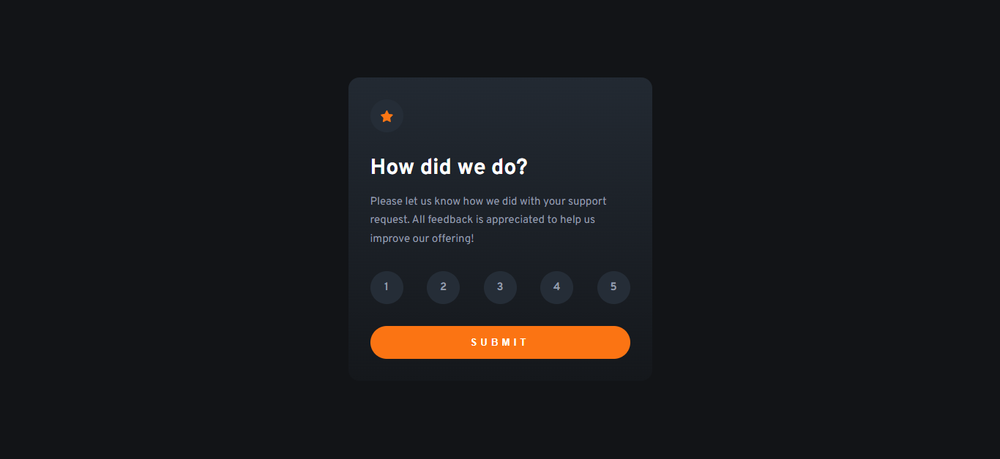

# Interactive Rating Component

Esta es una solución al [desafío del interactive-rating-component en Frontend Mentor](https://www.frontendmentor.io/challenges/interactive-rating-component-koxpeBUmI/hub). Los desafíos de Frontend Mentor lo ayudan a mejorar sus habilidades de codificación mediante la creación de proyectos realistas.

- Solution URL: [Github](https://github.com/ayrtonbolwal/fm-interactive-rating-component)
- Live Site URL: [Netifly](https://ayrtonbolwal-interactive-rating.netlify.app/)

## Mi Proceso

- Semántica de HTML5
- Variables en CSS
- Técnicas de Flexbox y display none.
- Convención BEM
- Desarrollo Javascript

## Cosas que aprendí

- Entrega de etapas con Git
- Convención BEM
- Extraer valores de form desde javascript
- Uso de querys selectors
- Edición de estilos desde javascript

## Recursos

- [Conveción BEM](https://www.freecodecamp.org/espanol/news/convenciones-de-nomenclatura-de-css-que-te-ahorraran-horas-de-depuracion/)
- [Position absolute](https://developer.mozilla.org/en-US/docs/Web/CSS/position)
- [Agregar archivos al repo](https://docs.github.com/es/repositories/working-with-files/managing-files/adding-a-file-to-a-repository)
- [Obtener valor de formulario](https://www.delftstack.com/es/howto/javascript/get-html-form-value/)
- [QuerySelector](https://developer.mozilla.org/es/docs/Web/API/Document/querySelector)
- [Eventos en JS](https://developer.mozilla.org/es/docs/Learn/JavaScript/Building_blocks/Events)

Happy Coding! 👾🖖
Tráiganme a javaScript 🔨⚡😎
